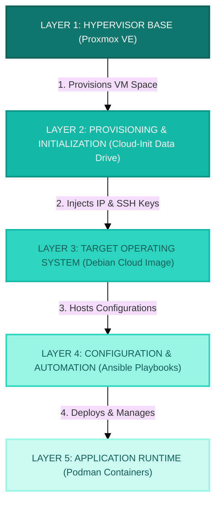
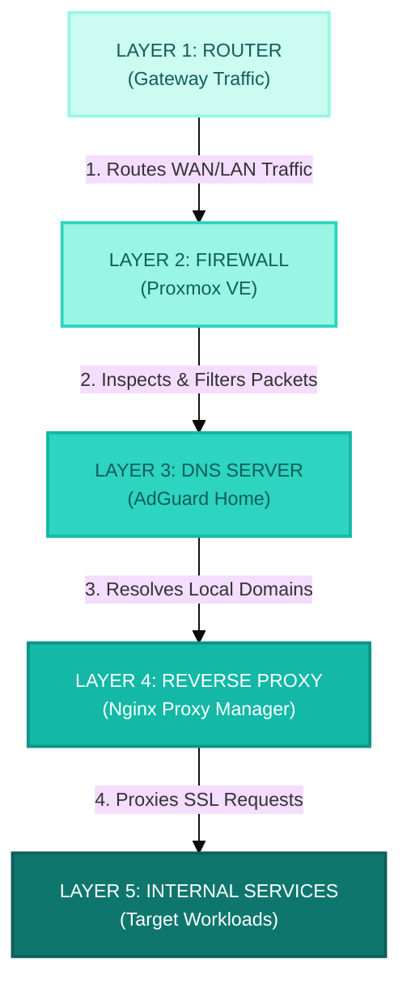

# Homelab-Infrastructure: Declarative System Deployment and Orchestration

Welcome to my primary homelab and infrastructure repository. This project serves as a live engineering portfolio demonstrating hands on experience in Systems Administration, Infrastructure as Code (IaC), and Network Security. 

I have designed and implemented a fully automated, layered deployment pipeline to host internal media, storage, and networking services securely under an unprivileged, zero root paradigm.

## Core Tech Stack and Competencies
| Pipeline Layer | Core Technology | Role |
| :--- | :--- | :--- |
| **Hypervisor Base** | **Proxmox VE** | Bare-metal resource allocation, Type-1 virtualization, network bridges |
| **Orchestration & IaC** | **Ansible** | Declarative configuration management, automated roles, secrets masking via Vault |
| **Initialization** | **Cloud-Init** | Automated OS bootstrapping, dynamic SSH key injection, instant cloud-image scaling |
| **Operating System** | **Debian Cloud Images** | Stable, minimal footprint, automated security update patching |
| **Container Runtime** | **Podman Quadlets** | Rootless container deployments, native systemd service process lifecycle integration |
---

## Hosted Services

| Category | Service | Function |
| :--- | :--- | :--- |
| **Networking & Security** | **AdGuard Home** | Local DNS resolution, telemetry sinkholing, ad-blocking |
| | **Nginx Proxy Manager** | Reverse proxy edge routing, SSL/TLS certificate termination |
| **Automation & Storage** | **Home Assistant** | Centralized smart home automation gateway |
| | **OpenMediaVault** | Network-Attached Storage (NAS) via secure NFS/SMB shares |
| **Media Workloads** | **Jellyfin & Navidrome** | Privacy-focused media streaming |

---

## Deployment Pipeline

My infrastructure is built from bare metal to application runtime using an automated, five-layer pipeline. This ensures that every virtual machine and container is fully declarative, reproducible, and easily maintained.

---

## Networking and Traffic Flow

Traffic routing follows a strict separation of concerns to maximize internal security, implement local DNS overrides, and eliminate port conflicts on the host system.

