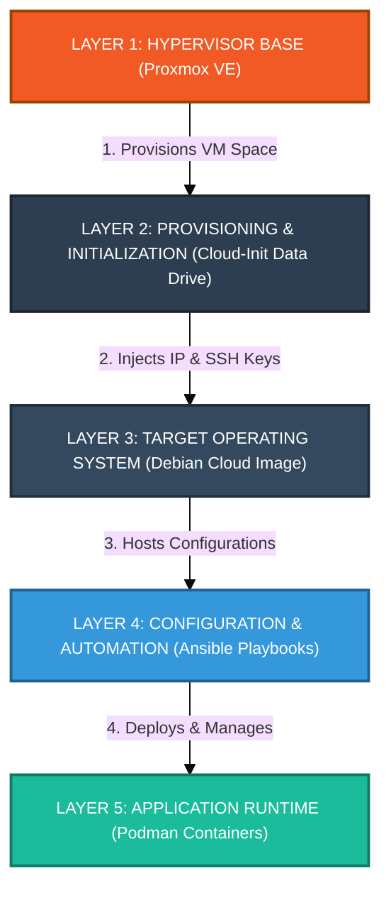

# Homelab-Infrastructure: Declarative System Deployment and Orchestration

Welcome to my primary homelab and infrastructure repository. This project serves as a live engineering portfolio demonstrating hands on experience in Systems Administration, Infrastructure as Code (IaC), and Network Security. 

I have designed and implemented a fully automated, layered deployment pipeline to host internal media, storage, and networking services securely under an unprivileged, zero-root paradigm.

## Core Tech Stack and Competencies

* Hypervisor Base: Proxmox VE (Type-1 Hypervisor)
* Provisioning and Automation: Ansible (Playbooks and Configuration), Cloud-Init (Automated OS initialization)
* Operating Systems: Debian (Cloud Images) - Stable, minimal OS baseline
* Containerization and Runtime: Podman (Rootless, systemd-integrated containerization)
* Networking: Nginx Proxy Manager (SSL termination, traffic multiplexing), AdGuard Home (Local DNS and telemetry sinkholing)

---

## Hosted Services

### Networking and Security

* AdGuard Home: Local DNS resolution, network-wide ad-blocking, and telemetry sinkholing.
* Nginx Proxy Manager: Edge reverse proxy managing SSL/TLS certificates and routing local domain traffic securely to backend containers.

### Core Automation and Storage

* Home Assistant: Centralized IoT and smart home automation gateway.
* Open Media Vault: Network-Attached Storage (NAS) management framework hosting local data shares via NFS/SMB.

### Media Streaming

* Jellyfin: Privacy focused, self hosted media streaming server for video workloads.
* Navidrome: Lightweight, high-performance music server and streamer.

---

## Deployment Pipeline

My infrastructure is built from bare metal to application runtime using an automated, 5-layer pipeline. This ensures that every virtual machine and container is fully declarative, reproducible, and easily maintained.

---

## Networking and Traffic Flow

Traffic routing follows a strict separation of concerns to maximize internal security, implement local DNS overrides, and eliminate port conflicts on the host system.

